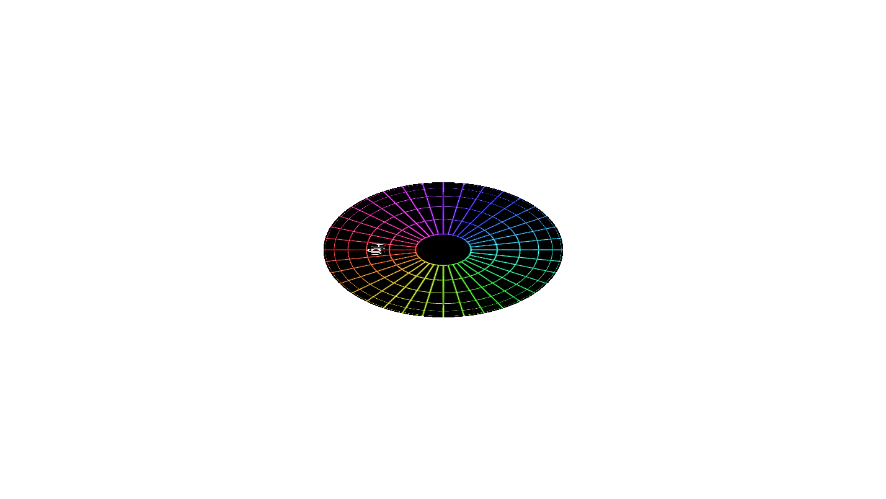
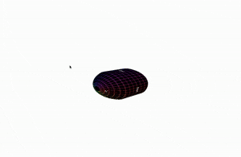

# RGRasterizer

Note: Everthing about this repo and library is very unfinished!

RGRasterizer is a 3d rasterization engine made entirley in JavaScript, and bundled with webpack.

## Installation

Currently, the only way to include RGRasterizer is to incude the bundled vanilla JavaScript file, however ES6 and node module releases will be coming shortly.

`<script src="rgrasterizer.js">`

This will expose the RG varible for use.

## Getting started

Let's build a simple scene with RGRasterizer! We will make a simple web app using only a couple files: 

```
testapp/
    index.html
    app.js
    rsc/
        capsule.obj
        capsule.mtl
        capsule_0.jpg

```

First, lets include the library and our apps main script in our index.html as before, and lets also add a canvas for us to render to:

##### **`index.html`**
```
<body>
    <canvas id="render"></canvas>

    <script src="rgrasterizer.js"></script>
    <script src="app.js"></script>
</body>
```

Next, lets head over to our app.js file. All you need to get started using RGRasterizer classes is that canvas element, and a canvasRenderingContext2d.

##### **`app.js`**
```
const canvas = document.getElementById('render');
const ctx = canvas.getContext('2d');

const width = canvas.width = window.innerWidth;
const height = canvas.height = window.innerWidth;
```

Now that all of the boring stuff is out of the way, lets start implementing RGRasterizer! There are a few things we need:

- A camera 
- A context
- A scene renderer
- A scene

Implementing those becomes very easy with the built in classes:

##### **`app.js`**
```
const myContext = RG.Context.createFromCanvas2d(ctx,1)

const myCamera = new RG.Camera(
    //A 3d dimensional vector representing the position of our camera in world space
    new RG.Vec3(0,0,-15)
);

const mySceneRenderer = new RG.SceneRenderer(myContext,myCamera)
const myScene = new RG.Scene();
```

We can start having fun now, lets load a .obj file, and add its objects to our scene

##### **`app.js`**
```
let loader = new RG.ObjLoader("./rsc/capsule/capsule.obj", () => {
    // After the test file has loaded, lets add the objects
    // contained in it into our scene. 

    // Lets also scale it down a bit.

    testObject = loader.getObjects()[0]
    testObject.scaleTo(4);
    myScene.add(testObject)
})
```

Were almost done now, lets just add a material to color our cat. It is a very similar proccess to adding the cat file itself. After this, we are ready to render!


##### **`app.js`**
```
// Passing a .mtl file, and a directory for the loader to search for texture files
let mtlLoader = new RG.MaterialLoader('./rsc/capsule/capsule.mtl', './rsc/capsule/', ()=>{
    // Lets give the scene the loaded materials
    myScene.useMTLs(mtlLoader.getMaterials());

    // And finally, lets render our scene:
    mySceneRenderer.drawFrame(myScene);
})
```
This code will result in the following:



Adding some quick camera movemnt and rotation we can make this simple scene animation:



This is just the tip of the iceberg, there is so much more that can be done with RGRasterizer! Explore it through the documentation.